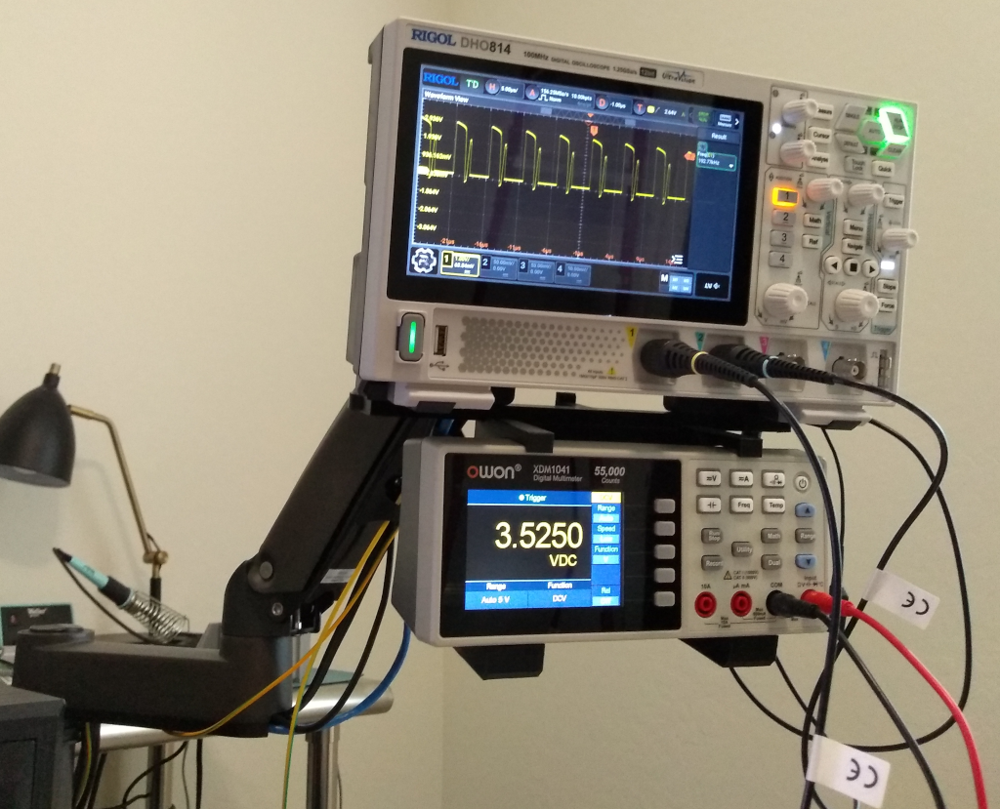

# Rigol DHO 800 plus Owon XDM 1041 Vesa mount

This project is a 3D printable vesa mounting bracket for the Rigol DHO 800 series 
digital oscilloscope with an Owon XDM 1041 digital multimeter mounted below the 
oscilloscope with probe storage hangers on the back.

# Files

The FreeCAD folder contains the 3D part designs for each 3D printed part.

The 3DSTL folder contains STL mesh files for use in a slicer.

# Materials

The materials for the bracket include the 3D printed parts, M4 6x6 thread inserts,
and a collection of M4 screws and washers.

* 3D printed parts
  * Base bracket for the bottom of the Owon meter
  * Top bracket for the top of the Owon meter
  * Back bracket to hold the base and top brackets together
  * Probe storage holder
  * Two L brackets with 100mm Vesa spacing for the Rigol Oscilloscope
  * Four standoff spacers for L brackets to Oscilloscope Vesa holes
* Hardware
  * 10 M4 6x6 threaded brass inserts
  * 8 M4 washers
  * 6 M4 x 16mm screws
  * 4 M4 x 20mm screws
  * 4 M4 x +30mm screws from Vesa mount

# Assembly

1. Bolt together the base bracket and back bracket.
2. Place Owon multimeter into the lower bracket then bolt the top bracket to the back bracket.
3. Bolt the probe storage holder to the top bracket.
4. Bolt the L brackets to the probe storage holder.
5. Bolt the assembled bracket to the Vesa mount and the Rigol oscilloscope with the spacers between the L brackets and the Rigol oscilloscope.

